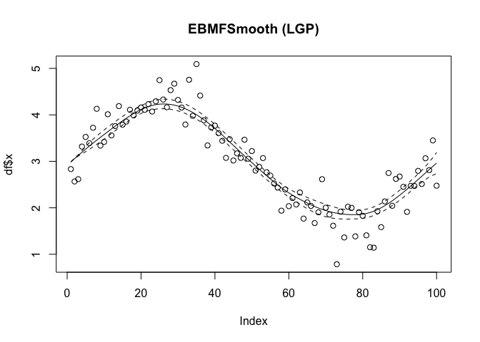

<!-- README.md is generated from README.Rmd. Please edit that file -->

# EBMFSmooth

<!-- badges: start -->

<!-- badges: end -->

The goal of EBMFSmooth is to generate empirical Bayes smoother with
various types of priors. The output function from this package can be
used for smoothing purpose, or as input for `flashier` to perform EBMF.

## Installation

You can install the development version of EBMFSmooth from
[GitHub](https://github.com/) with:

``` r
# install.packages("pak")
pak::pak("AgueroZZ/EBMFSmooth")
```

The package depends on `BayesGP` and `INLA` packages, which can be
installed with:

``` r
install.packages("BayesGP")
install.packages("INLA",repos=c(getOption("repos"),INLA="https://inla.r-inla-download.org/R/stable"), dep=TRUE)
```

## Example

This is a basic example which shows you how to solve a common problem:

``` r
library(EBMFSmooth)
f <- function(t) {
  3 + 1.2*sin(t)
}
n <- 100; set.seed(123)
t <- seq(0, 2*pi, length.out = n)
sd <- sample(x = c(0.1,0.3,0.5), size = length(t), replace = TRUE)
x <- f(t) + rnorm(length(t), sd = sd)
df <- data.frame(x = x, sd = sd)

setup <- LGP_setup(t = t, betaprec = -1)
ebgp <- ebnm_LGP_generator(setup, link = "identity")
res_lgp <- ebgp(df$x,df$sd)

plot(df$x,main="EBMFSmooth (LGP)")
lines(res_lgp$posterior$mean)
lines(res_lgp$posterior$mean+2*sqrt(res_lgp$posterior$var),lty=2)
lines(res_lgp$posterior$mean-2*sqrt(res_lgp$posterior$var),lty=2)
```


